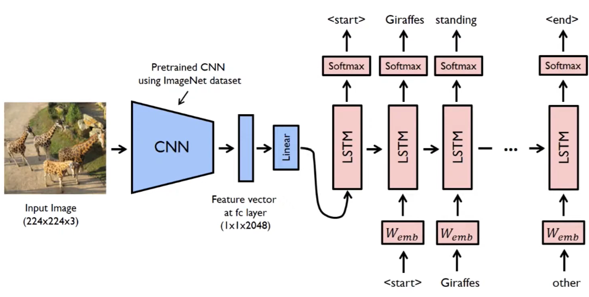

# 🖼️ Image Captioning with CNN + RNN (PyTorch)

This project implements an image captioning model using a **CNN encoder (e.g., EfficientNet)** and an **LSTM-based RNN decoder**. The model generates descriptive captions for input images by learning from paired image-caption datasets like MS-COCO.

---

## 📐 Model Architecture

- **Encoder**: Pretrained CNN (e.g., EfficientNetB0 or InceptionV3)
  - Extracts a feature vector from the input image
  - Final linear layer maps it to the LSTM's embedding dimension

- **Decoder**: LSTM
  - Takes the image feature followed by caption token embeddings
  - Predicts the next word at each time step

---

## 🔁 Input-Target Alignment Strategy

We train the model to predict the **next word** in a caption given the **image feature and previous words**.

For example, given the caption:
[SOS, dog, eating, food, EOS]


### Model sees:

| Time Step | Input               | Target (Expected Output) |
|-----------|---------------------|---------------------------|
| 0         | **Image feature**   | `<SOS>`                   |
| 1         | `<SOS>` embedding   | `dog`                     |
| 2         | `dog` embedding     | `eating`                  |
| 3         | `eating` embedding  | `food`                    |
| 4         | `food` embedding    | `<EOS>`                   |

- ✅ **Inputs**: `[image_feature] + [SOS, dog, eating, food]` → Length: 5  
- ✅ **Targets**: `[SOS, dog, eating, food, EOS]` → Length: 5  

---

## 🔧 Forward Pass (Sequence-First LSTM Format)

```python
# Image → feature vector
features = self.encoder(images)  # Shape: (batch_size, embed_dim)

# Caption input (excluding <EOS>)
embeddings = self.embed(captions[:-1])  # Shape: (seq_len-1, batch_size, embed_dim)

# Insert image features at t=0
features = features.unsqueeze(0)  # Shape: (1, batch_size, embed_dim)

# Final input to LSTM
inputs = torch.cat((features, embeddings), dim=0)  # Shape: (seq_len, batch_size, embed_dim)
```

## 📉 Loss Computation
After the decoder outputs predictions for each token:
```python
outputs.shape == (seq_len, batch_size, vocab_size)
```
Flatten and compute loss:
```python
loss = criterion(
    outputs.reshape(-1, outputs.shape[2]),  # Shape: (seq_len * batch_size, vocab_size)
    captions.reshape(-1)                    # Shape: (seq_len * batch_size)
)
```
🔍 Tensor Shape Summary
| Tensor                            | Shape                              | Description                    |
|----------------------------------|------------------------------------|--------------------------------|
| `outputs`                        | (seq_len, batch_size, vocab_size)  | Model predictions at each step |
| `captions`                       | (seq_len, batch_size)              | Ground truth tokens            |
| `outputs.reshape(-1, vocab_size)`| (seq_len × batch, vocab_size)      | Flattened predictions          |
| `captions.reshape(-1)`           | (seq_len × batch)                  | Flattened targets for loss     |


## 🚀 Inference (Greedy Decoding)
```python
with torch.no_grad():
    x = self.encoderCNN(image).unsqueeze(0)  # (1, 1, embed_dim)
    states = None
    for _ in range(max_length):
        hiddens, states = self.decoderRNN.lstm(x, states)
        output = self.decoderRNN.linear(hiddens.squeeze(0))
        predicted = output.argmax(1)
        result_caption.append(predicted.item())
        x = self.decoderRNN.embed(predicted).unsqueeze(0)
        if vocabulary.itos[predicted.item()] == "<EOS>":
            break
```


## 📦 Assets
assets/cover.png: Project banner


## 🙏 Credits
This implementation was inspired by the excellent tutorial by Aladdin Persson:
📺 Image Captioning | Deep Learning with PyTorch | CNN + RNN

Be sure to check out his channel for more deep learning content!


## 👨‍💻 Author
Built with ❤️ using PyTorch.
Open for contributions, improvements, or collaboration.


